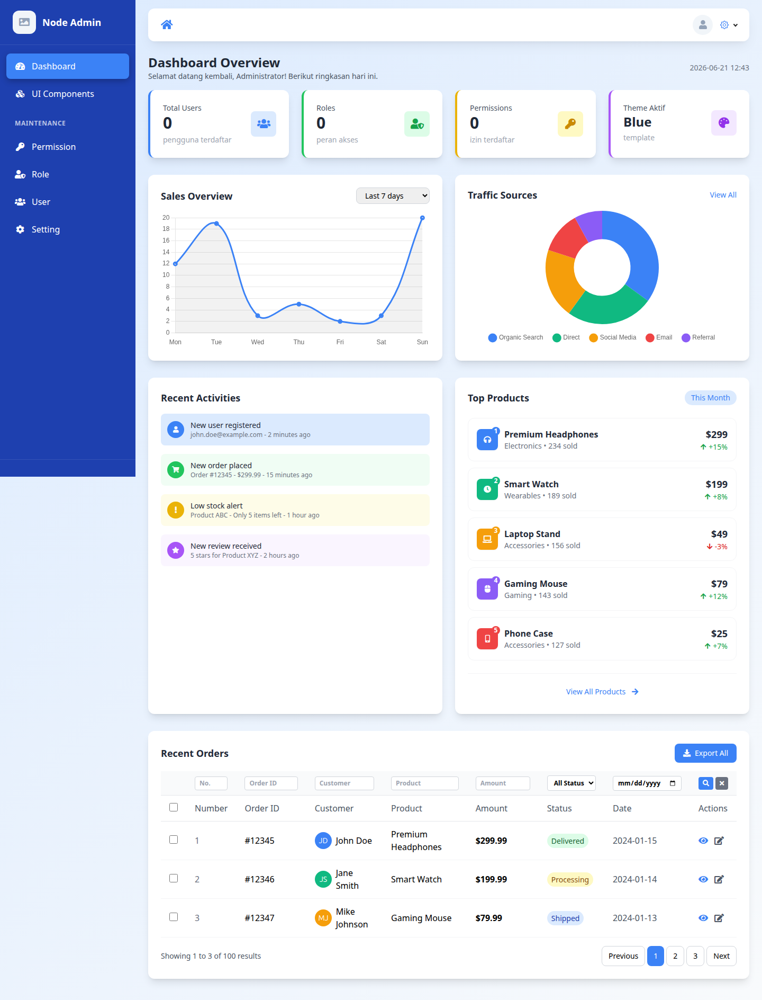
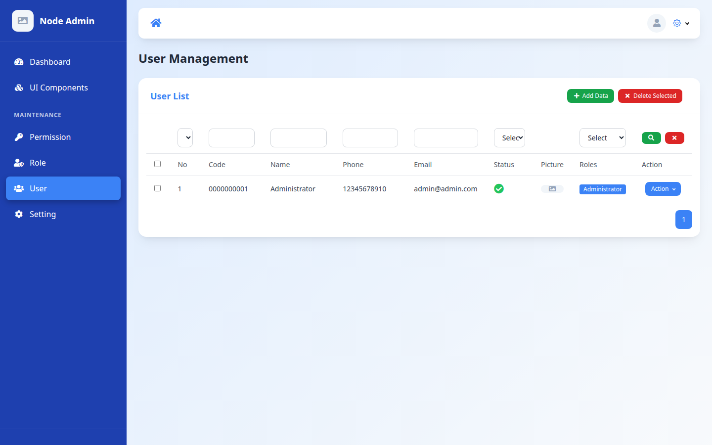
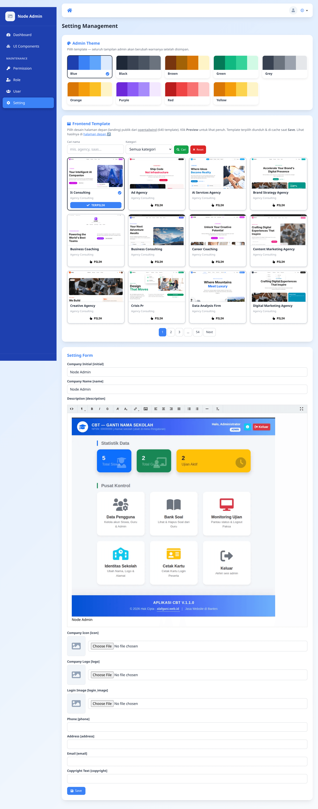
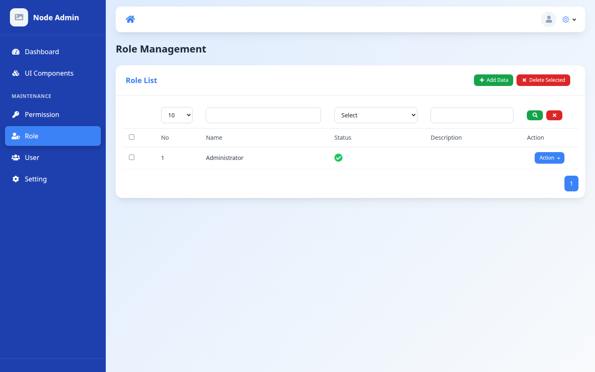
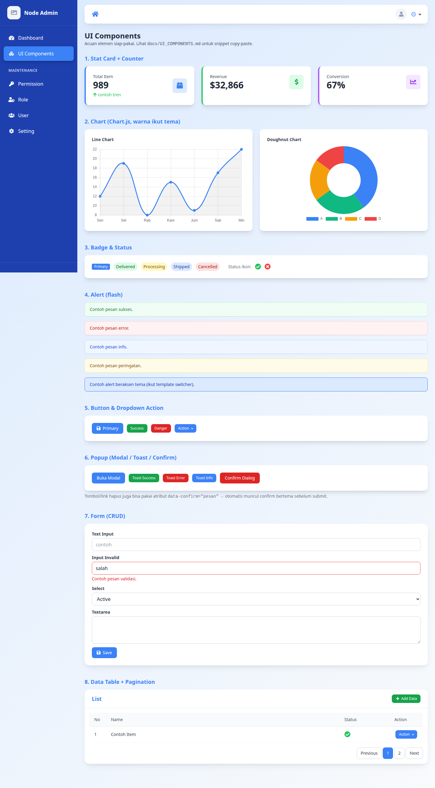
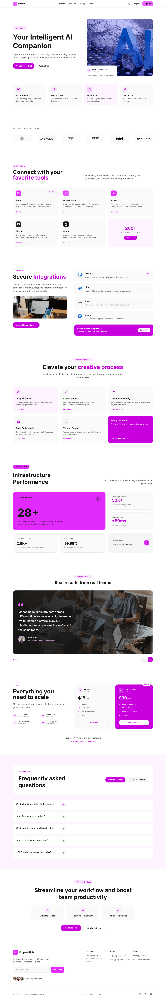

# Node Admin

Node Admin is a **starter pack / bootstrap** for building Node.js-based admin panel applications (TypeScript + Express + TypeORM). It is designed as a scalable foundation that applies solid software engineering principles, layered security, and a complete test suite.

## 🖼️ Screenshots

| Login | Dashboard |
|-------|-----------|
|  |  |

| User Management (RBAC) | Setting + Frontend Template (640 catalog) |
|------------------------|-------------------------------------------|
|  |  |

| Role & Permission | UI Components |
|-------------------|---------------|
|  |  |

| Home Page (default template, bound to Setting) |
|--------------------------------------------------|
|  |

---

## ✨ Features

- **User Management** — user CRUD, multi-role, profile photo.
- **Role & Permission (RBAC)** — route-based access control + per-action permissions.
- **Profile Management** — users manage their own profile & password.
- **Authentication** — sessions (Passport local + Redis) for the web & **JWT** for the API.
- **Password Reset** — OTP via email (hashed + expiry).
- **Template Switcher** — 9 color themes (Blue, Black, Brown, Green, Grey, Orange, Purple, Red, Yellow) that can be changed from the Setting page; the entire admin UI changes without a rebuild.
- **Frontend Template Switcher** — the public home page (served directly at the root `/`) with **640 landing designs** from [opentailwind](https://github.com/lindoai/opentailwind) (MIT), browsable in Setting via **search + category filter + pagination** (server-side); the active template is pinned to the first page. Each card shows a **live thumbnail** (scaled iframe) and clicking it opens a full **Preview**; the preview HTML is cached in the browser's `localStorage` to avoid loading the server. The selected template is downloaded & cached locally on **Save** — the app stays lean (only 1 default is bundled).
- **Default Home as a Sample** — the default template (EJS) binds to the **Setting** data (name, logo, description, contact, copyright) as a living example; change Setting → the home page changes too. It serves as the reference pattern when building a custom home page.
- **Multi-Database** — dialect-agnostic via TypeORM (MySQL, MariaDB, PostgreSQL, SQLite, MSSQL, Oracle) just by changing `DB_TYPE`.
- **Multi-Timezone** — date display follows the user's timezone (dayjs).
- **File Storage** — upload to object storage (Alibaba Cloud OSS or AWS S3 / S3-compatible: MinIO, Cloudflare R2, Backblaze B2) with image re-encoding via sharp.
- **Stateless** — sessions in Redis, files in object storage → ready for horizontal scaling.

---

## 🏗️ Architecture & Principles

The application is structured **modularly per feature** (`src/modules/<module>`), each module having layers: `routes → middleware → controller → service → entity → views`.

Principles applied (details in [`docs/ARCHITECTURE.md`](docs/ARCHITECTURE.md)):

| Principle | Implementation |
|---------|-----------|
| **SOLID** | Dependency Injection via [tsyringe](https://github.com/microsoft/tsyringe) — controllers & services are injected through the container (`src/container.ts`), services implement an interface (`I*Service`). |
| **DRY** | Centralized helpers: `paginate()`, `ciLike()`, `renderView()`, `removeEmptyFields()`. |
| **Separation of Concerns** | Controller (HTTP) ≠ Service (business) ≠ Repository (data) ≠ View (presentation). |
| **Clean Code** | Centralized error handling (`AppError` + `errorHandler` middleware); services `throw`, not `return error`. |
| **Low Coupling** | Components depend on abstractions (interfaces + DI tokens), not concrete implementations. |
| **Twelve-Factor** | Config via centralized & validated env (`src/config/env.ts`), stateless, logs to stdout, graceful shutdown. |
| **TDD / BDD** | Comprehensive test suite (see the Testing section). |

---

## 📁 Directory Structure

```
src/                     # application code
├── config/          # env (centralized & validated), ormconfig, app
├── container.ts     # DI registration (tsyringe)
├── tokens.ts        # DI tokens
├── services/        # fileService (storage adapter), mailer, settingCache
├── resources/       # EJS layouts & partials (be/default = active Tailwind theme)
└── modules/
    ├── access/      # user, role, permission (RBAC)
    ├── auth/        # login, register, JWT, password reset
    ├── components/  # UI component showcase
    ├── dashboard/
    ├── profile/
    └── setting/     # setting + template switcher
tests/               # unit, integration, api, security, smoke, e2e, bdd
docs/                # ARCHITECTURE.md, TESTING.md, API.md
```

---

## 🚀 Installation

```bash
git clone https://github.com/NodeJsTech-Id/NodeAdmin.git
cd NodeAdmin
npm install
```

### 1. Prepare the database

Default is MySQL — create an empty database:
```sql
CREATE DATABASE nodeadmin;
```
(For other databases, see the **Multi-Database** section below.)

### 2. Configure `.env`

Copy `.env.example` to `.env`, then fill it in. **Required** in production: `SESSION_SECRET` & `JWT_SECRET` (the app halts if they are empty when `NODE_ENV=production`).

```bash
cp .env.example .env
# generate a secret:
node -e "console.log(require('crypto').randomBytes(32).toString('hex'))"
```

Important variables:
```
APP_PORT=3000
NODE_ENV=development

DB_TYPE=mysql            # mysql | mariadb | postgres | sqlite | mssql | oracle
DB_HOST=localhost
DB_PORT=3306
DB_USERNAME=root
DB_PASSWORD=
DB_DATABASE=nodeadmin

REDIS_URL=redis://127.0.0.1:6379

SESSION_SECRET=          # REQUIRED in production
JWT_SECRET=              # REQUIRED in production
JWT_EXPIRES_IN=1h
BCRYPT_ROUNDS=10
OTP_EXPIRY_MINUTES=10

# File storage — STORAGE_DRIVER: oss | s3
# oss: Alibaba Cloud OSS (isi STORAGE_ENDPOINT)
# s3 : AWS S3 atau S3-compatible (MinIO, Cloudflare R2, Backblaze B2, dll)
#      AWS S3 murni: kosongkan STORAGE_ENDPOINT, isi STORAGE_REGION
#      S3-compatible custom: isi STORAGE_ENDPOINT + STORAGE_REGION
STORAGE_DRIVER=oss
STORAGE_ACCESS_KEY_ID=
STORAGE_SECRET_ACCESS_KEY=
STORAGE_ENDPOINT=oss-ap-southeast-5.aliyuncs.com
STORAGE_BUCKET=
STORAGE_REGION=
STORAGE_SSL=true
```

### 3. Migrate + seed

```bash
npm run migration:run
```
Creates the schema + seeds the default admin & initial setting data.

### 4. Run

```bash
npm run start:dev      # dev mode (nodemon + ts-node)
# or
npm start              # production mode (build + pm2 from dist)
```

Open **http://localhost:3000** — the public home page is rendered directly at the root (no redirect, clean URL); `/home` is an explicit alias. The admin login is at **http://localhost:3000/auth/login**. Default login:
```
Email   : admin@admin.com
Password: 12345678
```
> ⚠️ Change the admin password before going to production.

---

## 🗄️ Multi-Database

The application is dialect-agnostic. Change `DB_TYPE` + install the appropriate driver:

| DB | DB_TYPE | Driver |
|----|---------|--------|
| MySQL | `mysql` | `mysql2` (installed) |
| MariaDB | `mariadb` | `mysql2` |
| PostgreSQL | `postgres` | `pg` (installed) |
| SQLite | `better-sqlite3` | `better-sqlite3` (dev) |
| SQL Server | `mssql` | `mssql` |
| Oracle | `oracle` | `oracledb` |

SQLite: set `DB_DATABASE` to a file path (e.g. `./dev.sqlite`). Then run `npm run migration:run`.

---

## 🎨 Template Switcher

Log in → **Setting** menu → pick one of the 9 color swatches → **Save**. The entire admin UI & login page change color instantly (stored in `settings.theme`, read via a CSS variable). The palettes are defined in `src/config/themes.ts`.

---

## 🔒 Security

- **Helmet** — security headers (HSTS, X-Frame-Options, nosniff).
- **CSRF protection** — synchronizer tokens for all web forms (`src/middleware/csrf.ts`).
- **Rate limiting** — login / register / OTP are throttled per IP.
- **Session cookie** — `httpOnly`, `sameSite`, `secure` (automatic in production).
- **Password** — bcrypt; OTP reset is hashed + expiry + rate-limit.
- **JWT** — algorithm is pinned (HS256), blacklisted on logout (TTL).
- **RBAC** — `ensureAuthenticated` → `AccessMiddleware` on every admin route.
- **Mass-assignment guard** — Joi `stripUnknown` on input.
- **Upload validation** — magic-byte (sharp), extension whitelist.
- **Secrets** — fail-fast if `SESSION_SECRET`/`JWT_SECRET` are empty in production.

---

## 🧪 Testing

A complete suite — details in [`docs/TESTING.md`](docs/TESTING.md).

| Command | Coverage |
|----------|---------|
| `npm test` | All Jest (unit + integration + api + security + smoke) |
| `npm run test:unit` | Pure helpers |
| `npm run test:integration` | Service ↔ DB (SQLite in-memory) |
| `npm run test:api` | Endpoints via supertest |
| `npm run test:security` | RBAC, CSRF, rate-limit, JWT, mass-assign |
| `npm run test:smoke` | Health, login, DB connect |
| `npm run test:coverage` | Jest + coverage report |
| `npm run test:e2e` | Playwright (browser, 3 engines) |
| `npm run test:bdd` | Cucumber (Gherkin scenarios) |

CI (GitHub Actions, `.github/workflows/ci.yml`): typecheck + Jest + audit + DB matrix (MySQL/Postgres) + Playwright on every push/PR.

---

## 🔌 API

REST endpoints at `/api/v1/*` (auth via JWT Bearer). The full list + request/response examples are in [`docs/API.md`](docs/API.md).

Summary:
- `POST /api/v1/auth/login` → obtain an `access_token`
- `/api/v1/access/user|role|permission` → CRUD (requires `Authorization: Bearer <token>`)
- `/api/v1/profile` → own profile

---

## 📜 Scripts

```
npm run build            # compile TS + copy views to dist
npm run start:dev        # dev (nodemon + ts-node)
npm start                # build + pm2
npm run migration:run    # run migrations
npm run migration:revert # roll back the last migration
npm run migration:create # create a new migration file
npm test / test:*        # see the Testing section
npx nodeadmin add-ui     # upgrade an API-only install → Full (add the UI layer)

```

---

## 🧩 Tech Stack

TypeScript · Express · TypeORM · MySQL/PostgreSQL/etc. · Redis (session) · EJS + Tailwind · tsyringe (DI) · Passport (local + JWT) · Joi · Jest + supertest · Playwright · Cucumber · Object Storage (OSS / S3-compatible) · Helmet.

---

## License

The Node Admin is open-sourced software licensed under the [MIT license](https://opensource.org/licenses/MIT).
